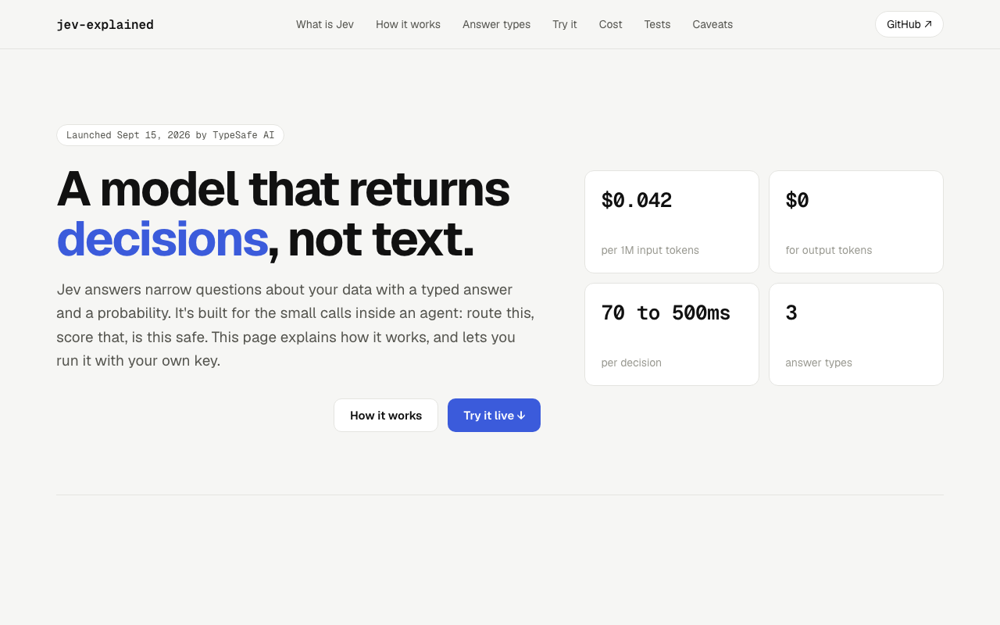

# jev-explained

[](https://github.com/itani404/jev-explained/actions/workflows/ci.yml)



A walkthrough of [Jev](https://vercel.com/ai-gateway/models/jev), TypeSafe AI's "System One" decision model, with code you can actually run: one example per answer type, an example of what to do when Jev isn't sure, a benchmark script, and a local interactive explainer.

I'm not just repeating TypeSafe's launch numbers here. The examples were run against the live API, and the speed and cost numbers below come from independent tests, with links.

## What is Jev

Jev isn't a chatbot. You give it a question and some evidence, and it hands back a typed answer with a probability attached, no free text to parse. It's meant for the boring decisions inside an agent pipeline: routing, classification, scoring.

Three answer types:

- Choice: pick from a fixed set of options
- Score: rate something against a rubric
- Boolean: yes/no with a probability

You call it through Vercel's AI Gateway using the AI SDK's `evaluate()` function.

## What independent tests found

TypeSafe's launch numbers were 193.6x faster and 444.6x cheaper than frontier LLMs. Developers who tested it in the first week got smaller, but still large, gaps:

| Test                                                                                                             | Task                               | Compared with    | Faster                  | Cheaper | Accuracy                                           |
| ---------------------------------------------------------------------------------------------------------------- | ---------------------------------- | ---------------- | ----------------------- | ------- | -------------------------------------------------- |
| [jev-aita](https://github.com/dchristopoulos/jev-aita)                                                           | 770 Reddit AITA verdicts           | Claude Sonnet 5  | 6.3x (0.39s vs 2.46s)   | 62x     | Sonnet slightly better                             |
| [DEV Community](https://dev.to/arifulislamat/typesafes-jev-model-is-it-really-193x-faster-and-444x-cheaper-56oa) | 100 support tickets, 400 decisions | Claude Sonnet 5  | 5.2x (474ms vs 2,479ms) | 64x     | 100% agreement when very confident, 72% below 0.70 |
| [LiteLLM](https://docs.litellm.ai/blog/jev-auto-router-benchmark)                                                | 240 routing decisions              | Claude Haiku 4.5 | 5.4x (127ms vs 688ms)   | 26x     | Jev 95% vs Haiku 74%                               |

Short version: about 5 to 6x faster and 26 to 64x cheaper, with accuracy close to the big models. Different tasks and setups, so compare the pattern, not the exact numbers. Figures are as reported by each source (published Sept 17 to 20, 2026).

## What's in this repo

1. Three examples, one per answer type, so you can see the actual request and response shape.
2. A low-confidence example. Jev always returns a valid answer, but not always a sure one. This shows how to act only above a confidence threshold and send the rest to a person.
3. A benchmark script that runs the same task through Jev and Claude Sonnet 5 and prints latency and cost from that run.
4. A local interactive explainer with a playground.

## Structure

```
jev-explained/
├── app/
│   ├── page.tsx              # server-rendered page, composed from components/
│   ├── layout.tsx            # metadata, fonts
│   ├── opengraph-image.tsx   # generated link-preview image
│   └── api/evaluate/route.ts # validated, rate-limited proxy to Jev
├── components/               # one component + one CSS module each
├── hooks/
├── lib/
│   ├── content/              # page copy, scenarios, benchmark data
│   ├── evaluate-request.ts   # zod schema shared by the route and tests
│   ├── gateway-errors.ts     # maps AI Gateway errors to friendly messages
│   ├── pricing.ts            # the one place prices live
│   └── types.ts
├── scripts/
│   ├── examples/             # choice, score, boolean, low-confidence
│   └── benchmark.ts
└── tests/
```

## Prerequisites

- A Vercel account with a card on file (AI Gateway requires this even for the free tier)
- An AI Gateway key
- Node 20+

Vercel gives you $5/month of free Gateway credit. Jev costs $0.042 per million input tokens with free output, so the examples and the explainer run on the free tier without costing you anything noticeable.

The benchmark is the exception: it calls Claude Sonnet 5, which Vercel's free tier doesn't allow. You need paid Gateway credits to run it. That's why the numbers above come from independent tests.

## Setup

```bash
git clone https://github.com/itani404/jev-explained.git
cd jev-explained
npm install
cp .env.example .env.local
# add your AI_GATEWAY_API_KEY to .env.local
```

## Running it

```bash
npm run example:choice
npm run example:score
npm run example:boolean
npm run example:low-confidence
npm run benchmark   # needs paid Gateway credits
```

Checks:

```bash
npm run lint
npm run typecheck
npm test
```

## Try it in the browser (locally)

`npm run dev` and open `localhost:3000`. It's an interactive explainer: what Jev is, how a call works, the three answer types, a cost calculator, the independent test results, and a playground where you paste some text and get back the real typed response, probability, latency, and cost. It runs on your machine against your own key. On a hosted copy (anything built on Vercel) the playground switches itself off and shows the clone steps instead, so nobody spends your key. Set `PLAYGROUND=on` to override that.

## Where this falls short

- A valid answer doesn't mean a correct one. Jev guarantees the shape of the answer, not that it's right. Check the probability, and test it against labeled examples from your own data before trusting it in production.
- The 193.6x / 444.6x launch numbers are TypeSafe's own benchmarks, built on four workflows they made themselves, and they've said those are the high end. Independent tests land much lower (see above).
- Jev launched in September 2026. Fast adoption by platforms isn't the same as proven reliability over time.

## Stack

TypeScript. Jev's real interface is the AI SDK's `evaluate()` function, which is JS/TS only, so that's what this uses instead of raw HTTP calls. The explainer is a Next.js App Router app: the page is a Server Component, with client components only where there's interaction. Tests use Node's built-in test runner through `tsx`.

## Author

Built by [@itani404](https://github.com/itani404). Independent project, not affiliated with TypeSafe AI or Vercel. Issues and PRs welcome.

## License

MIT, see [LICENSE](LICENSE).
